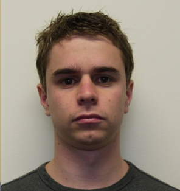
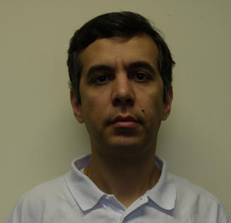
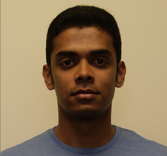

Official Matlab implementation of **[Domain-Specific Face Synthesis for Video Face Recognition from a Single Sample Per Person](https://arxiv.org/pdf/1801.01974.pdf)**
===========

This page contains end-to-end demo code that generates the 3D facial shape and texture from an unconstrained 2D face image based on the information obtained from generic set.  

    
	
	

    
	
	

## Data
- **[ChokePoint](http://arma.sourceforge.net/chokepoint/)** .

## Prerequisite:

Note: the code only works in Windows 64x

- **[Download the Basel Face Model](http://faces.cs.unibas.ch/bfm/main.php?nav=1-2&id=downloads)** and move `01_MorphableModel.mat` into the folders.

## Citation:

If you find this work useful, please cite our paper with the following bibtex:

@article{mokhayeri2018domain,
  title={Domain-Specific Face Synthesis for Video Face Recognition from a Single Sample Per Person},
  author={Mokhayeri, Fania and Granger, Eric and Bilodeau, Guillaume-Alexandre},
  journal={arXiv preprint arXiv:1801.01974},
  year={2018}
}
